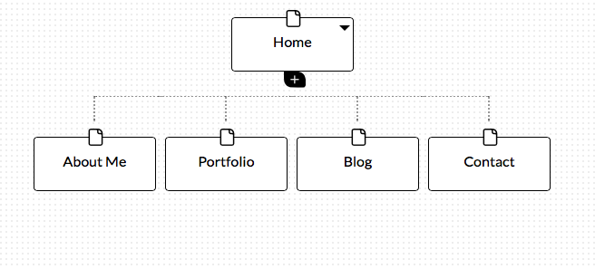

**What are the 6 Phases of Web Design?**
Information Gathering, Planning, Design, Development, Testing and Delivery, and Maintenance
**What is your site’s primary goal or purpose? What kind of content will your site feature?**
My website will be a showcase for my skills as a web developer, and the primary purpose is to give information about myself and promote myself for hiring. I will include content such as a brief bio, examples of my work and blog posts.
**What is your target audience’s interests and how do you see your site addressing them?**
My target audience will be professionals in the tech industry looking to hire a web developer for their projects, or those interested in web development who want to learn more about the field. I will address these interests by providing content that will show my work and skill set, as well as blog posts on a variety of topics relevant to programming.
**What is the primary “action” the user should take when coming to your site? Do you want them to search for information, contact you, or see your portfolio?**
The primary action the user should take is to learn about me and see my portfolio of past projects.
**What are the main things someone should know about design and user experience?**
User experience is fairly subjective, so it’s more difficult to assess and can mean different things based on the project or company. There is no one right way to design an enjoyable user experience.
The main thing someone should know about design is that it reflects a problem solving process, and the final product reflects the solution. Design should always be treated as solving a specific problem, and designers should avoid looking at other websites as the “right” way to do something.
**What is user experience design and why is it valuable?**
User experience design is a from of design that takes into account the way a user feels while using a website or software application. Factors such as ease of use, enjoyable experience and the sense of having received something of value contribute to a user’s satisfaction and a website’s success and better profits.
**Which parts of the challenge did you find tedious?**
I found most of the challenge interesting, the most tedious parts were probably doing the standard GitHub pulls to put it in my repository.

