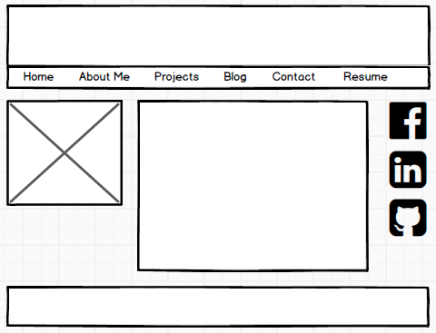
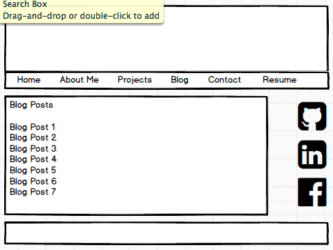

**2.4 Wireframing Reflection**

**What is a wireframe?**

A wireframe is a visual representation of what a finished web page will look like, using simple black and white boxes and symbols.

**What are the benefits of wireframing?**

Wireframes are beneficial because they allow a view of what the website layout will be in black and white, before any colors or designs are added. Wireframes are also a good way to show potential clients what the site will look like.

**Did you enjoy wireframing your site?**

I enjoyed wireframing my site and coming up with multiple versions before I found one I liked.

**Did you revise your wireframe or stick with your first idea?**

I went through several drafts before settling on a final draft.

**What questions did you ask during this challenge? What resources did you find to help you answer them?**

I asked myself what were the components of a good wireframe, and I followed the links in the assignment readings to see examples of professional work.

**Which parts of the challenge did you enjoy and which parts did you find tedious?**

I enjoyed using Balsamiq to make my wireframes, since they have so many features to choose from. The part I found tedious was the git file creating and pull request workflow.

