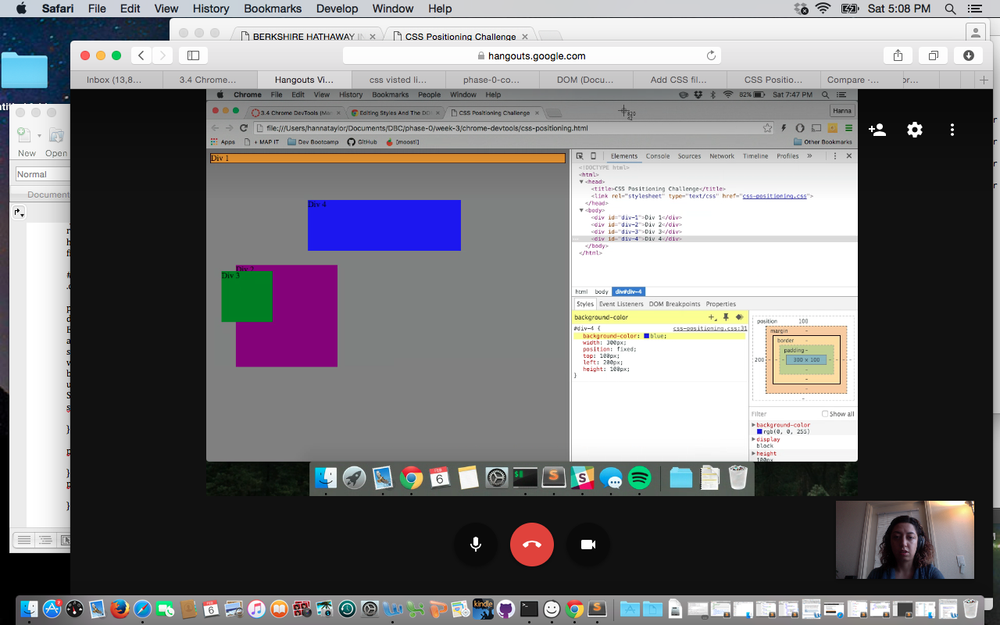
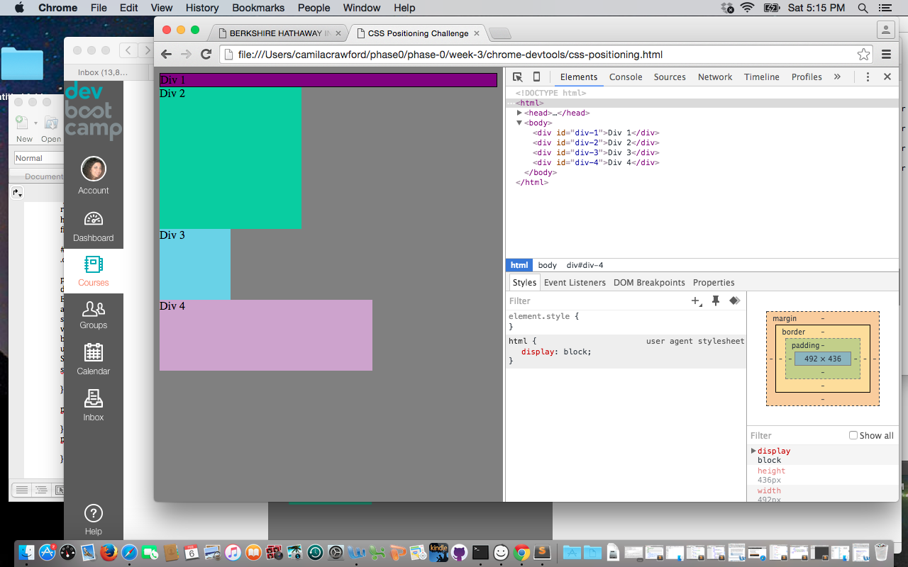
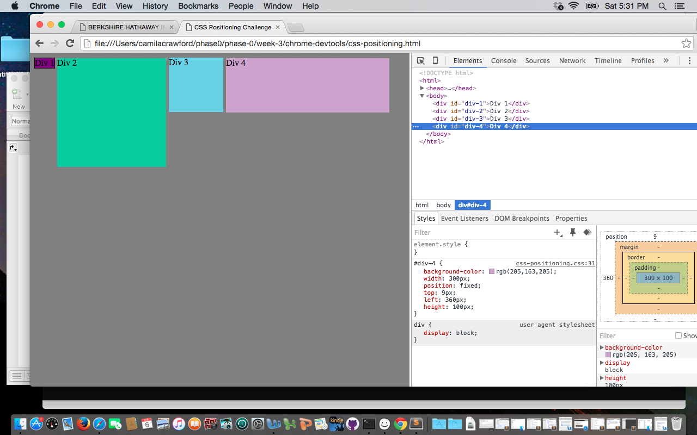
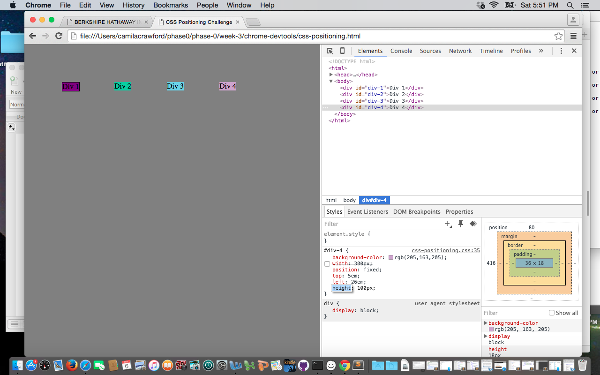
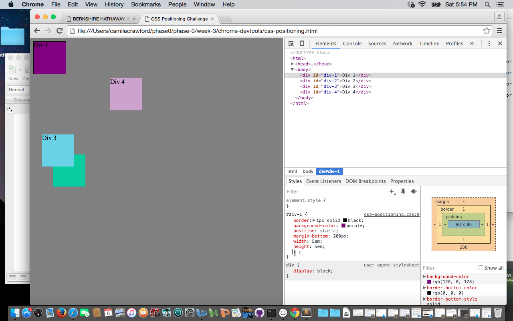
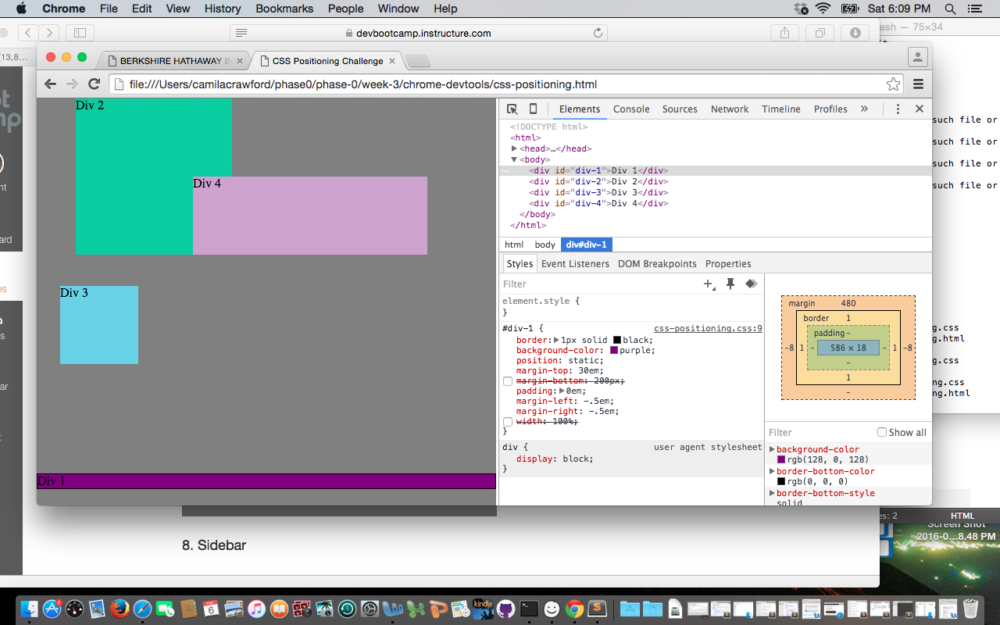
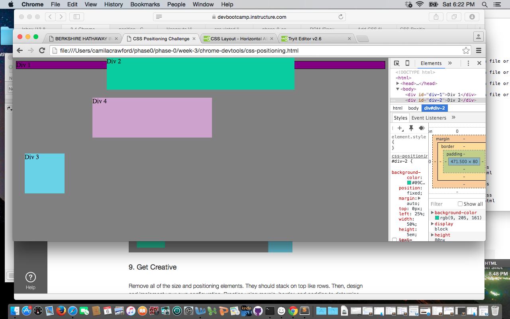
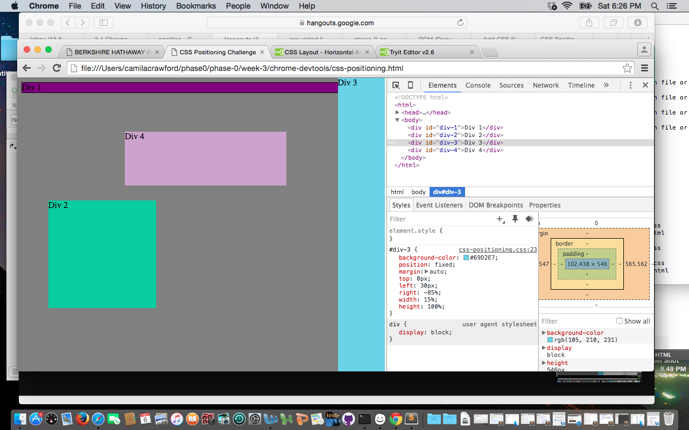
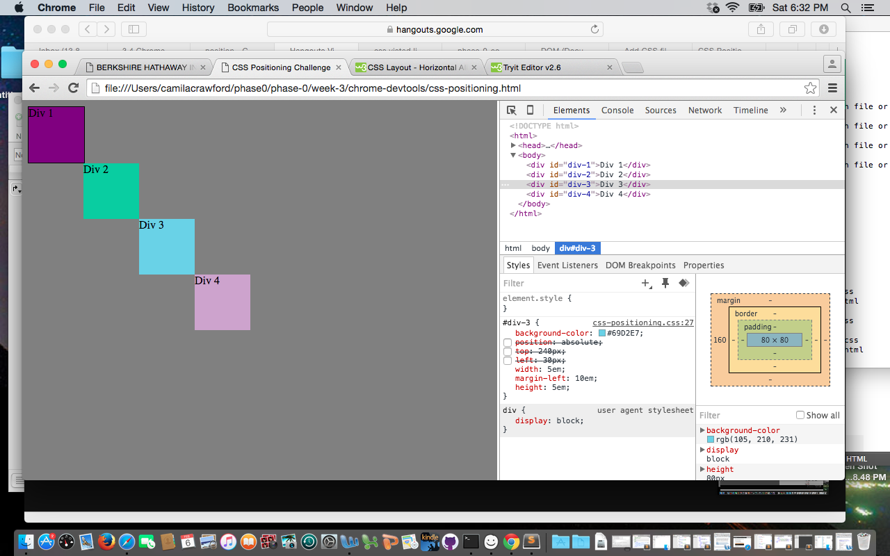

*3.4 Positioning Reflection*

**How can you use Chrome’s DevTools inspector to help you format or position elements?**

The DevTools inspector helps to format and position elements by showing the html, css, and the output all on one screen. It allows you to add to and edit the code, and even switch on and off css styling.

**How can you resize elements on the DOM using CSS?**

Resizing elements on the DOM can be done by changing the width and height properties using CSS.

**What are the differences between absolute, fixed, static, and relative positioning?**

Absolute means an element is positioned relative to its closest ancestor or containing block.
Fixed means an element is positioned relative to its web browser window.
Static positioning is where elements are rendered in the order of their appearance in the document flow.
Relative positioning is where the element is positioned relative to its normal position.

**Which did you find easiest to use? Which was the most difficult?**

I found relative positioning easiest to use, because in the challenge we needed to push the divs to one side and this was a simple way to allow it. Fixed positioning was probably the most difficult because it wasn’t quite as intuitive to use.

**What are the differences between margin, border, and padding?**

The margin is the space outside the border of the element. The border goes around the edge of the element. Padding goes between the content of the element and the border.

**What was your impression of this challenge overall?**

I personally enjoyed this challenge, as a visual learner it was nice to see in real-time the effects changing the CSS had on the divs. It was helpful to learn about DevTools and I would use it in the future.

